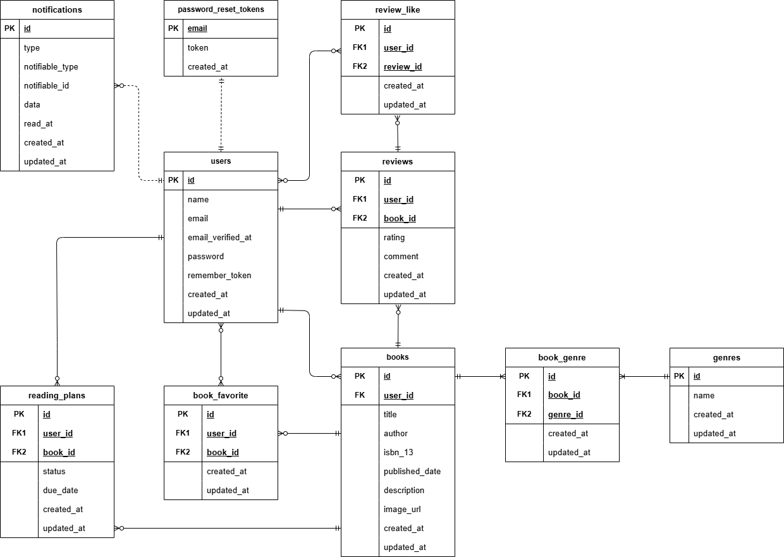

# bookshelf-app

## 概要
Laravelを用いて開発した書籍レビュー管理アプリです。 
ユーザーは書籍を登録・閲覧し、レビューの投稿やお気に入り登録ができます。 
ジャンルによる分類やレビューへのいいね機能、平均評価に基づくランキング機能も備えています。 

### 機能
※実装後に詳細に記載します。 

## 環境構築
※実装後に詳細に記載します。後ほど修正しますが、一旦一通りの流れを書いています。 
※ Docker Desktop を起動した状態で以下の手順を実行してください。 

1. リポジトリをクローン 
git clone ●● 
cd bookshelf-app 
docker-compose up -d --build 

2. composer install 
docker-compose exec php composer install 

3. `.env`を作成 
cd src 
cp .env.example .env 

- docker-compose.ymlのmysqlの箇所を参考に、設定値を変更してください。 
DB_HOST=mysql 
DB_DATABASE=laravel_db 
DB_USERNAME=laravel_user 
DB_PASSWORD=laravel_pass 

※「メール認証機能の設定」については後述いたします。 

4. アプリキー生成 
docker-compose exec php php artisan key:generate 
docker-compose exec php chown -R www-data:www-data storage bootstrap/cache 
docker-compose exec php chmod -R 775 storage bootstrap/cache 

5. マイグレーション 
docker-compose exec php php artisan migrate 
docker-compose exec php php artisan db:seed 

### メール認証機能
LaravelのEmail Verification機能を利用し、会員登録時にメール認証を必須としています。 
未認証ユーザーはログイン後も一部機能にアクセスできない仕様としています。 

開発環境では Mailtrap を使用し、送信メールの動作確認を行っています。 
`.env`ファイルについて、MailtrapのMy Sandbox内にあるUsername、Passwordを確認し、ご自身の設定値に変更してください。 
※Credentials の該当箇所を確認してください。 

- Mail設定例 
MAIL_MAILER=smtp 
MAIL_HOST=sandbox.smtp.mailtrap.io 
MAIL_PORT=2525 
MAIL_USERNAME=your_username 
MAIL_PASSWORD=your_password 
MAIL_ENCRYPTION=tls 
MAIL_FROM_ADDRESS=noreply@example.com 
MAIL_FROM_NAME="${APP_NAME}" 

## 画面定義
※実装後に詳細に記載します。 

- phpMyAdmin：http://localhost:8080/
- 会員登録画面（一般ユーザー）：http://localhost/register
- ログイン画面（一般ユーザー）：http://localhost/login

## 使用技術（実行環境）
- PHP 8.5.7
- Laravel 10.50.3
- MySQL 8.4.9
- Docker
- Mailtrap
- PHPUnit

## ER図

## テーブル設計方針
※実装後に詳細に記載します。 

## ログイン情報（動作確認用アカウント）

### ユーザー1
- メールアドレス：user1@example.com
- パスワード：aaaa1111

### ユーザー2
- メールアドレス：user2@example.com
- パスワード：bbbb2222

※ 上記アカウントは `php artisan db:seed` 実行時に作成されます。 
※ すべてのユーザーについて、メール認証済みの状態で作成されています。 

## テスト
※実装後に詳細に記載します。 
Featureテスト、Unitテストを中心に実装しています。 

### テスト環境構築
※実装後に詳細に記載します。後ほど修正しますが、一旦一通りの流れを書いています。 

1. データベースを作成 
- rootユーザーで MySQL にログイン 
docker compose exec mysql bash 
mysql -u root -p 
※パスワードは、docker-compose.ymlファイルのMYSQL_ROOT_PASSWORD:に設定されている値を入力してください。 

- demo_test というデータベースを作成 
CREATE DATABASE demo_test; 
SHOW DATABASES; 
※SHOW DATABASES;入力後、demo_testが作成されていれば成功です。 

2. `.env` をコピーして `.env.testing` を作成 
cd src 
cp .env .env.testing 

3. `.env.testing` のAPP_ENVとAPP_KEY=を以下のように変更 
APP_ENV=test 
APP_KEY= 

※ APP_KEYはテスト用に再生成するため、一度空にしてください。 
その後、後述のコマンド（key:generate）でテスト用キーを生成します。 

4. `.env.testing` のDB設定を以下のように変更 
DB_CONNECTION=mysql_test 
DB_DATABASE=demo_test 
DB_USERNAME=root 
DB_PASSWORD=root 

※【重要】本番用データベースと分離するため、テスト専用DBを使用しています。 
必ず『DB_DATABASE=demo_test』に書き換えるようお願いいたします。 

### テスト用データベースを作成
docker-compose exec php php artisan key:generate --env=testing 
docker-compose exec php php artisan migrate:fresh --env=testing 

### テスト実行
docker-compose exec php php artisan test 

※ テストでは RefreshDatabase を使用し、各テスト実行ごとにDBをリセットしています。 

